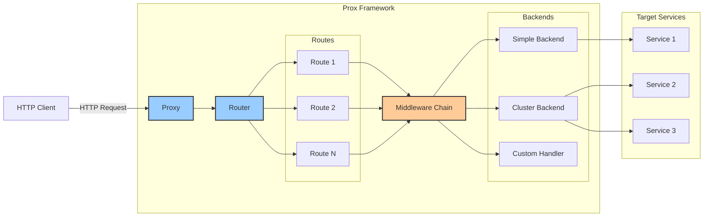
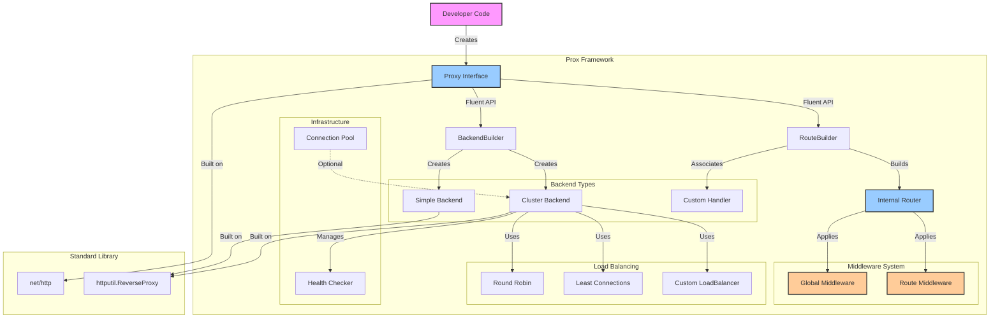

# Overview

# Context

In the development of cloud-native applications, API Gateways and Reverse Proxies have become indispensable components. As the adoption of microservices architecture continues to grow, the importance of layers that handle cross-cutting concerns such as inter-service communication management, routing, authentication/authorization, and rate limiting is increasing daily.

Currently, there are many options available such as Envoy, Nginx, Kong, and Traefik. However, for teams developing microservices in Go, these solutions present the following challenges:

**Configuration Complexity and Code Disconnect**: While YAML or JSON-based configuration files are manageable in the initial stages, they have limitations when implementing complex business logic for routing or dynamic behaviors. Developers are forced to work within the constraints of configuration languages, causing originally simple logic to become unnecessarily complex.

**Difficulty in Extensibility and Customization**: Extending existing proxy solutions requires learning different plugin systems for each - C++ (Envoy), Lua (Nginx/Kong), or Go (Traefik). Additionally, plugin development, debugging, and testing follow different workflows from main application development, reducing development efficiency.

**Challenges in Serverless Environments**: In serverless environments like Cloud Run, AWS Lambda, and Vercel, startup time and memory usage directly impact costs. General-purpose proxy solutions, being feature-rich, often introduce excessive overhead in these environments.

**Fragmented Developer Experience**: Between Go-written microservices and configuration file-managed proxy layers, approaches differ for testing strategies, deployment pipelines, monitoring, and logging. This makes it difficult to provide a unified developer experience.

Given this background, there is growing demand for a framework that allows Go developers to define proxy/API Gateway behavior in Go code and develop, test, and deploy using the same workflow as their existing Go applications. A code-first approach allows complex business logic to be expressed naturally and makes it easier to share knowledge across teams.

# Scope

Development of a framework for building custom proxies/API Gateways in Go. Provides a modular design that allows developers to select and combine the features they need.

**Core Components**:
- Base implementation of HTTP reverse proxy
- Pluggable middleware system
- Declarative and programmable routing

**Optional Components**:
- Multiple load balancing strategies (for standalone operation)
- Health checks and circuit breakers
- Connection pooling

**Developer Features**:
- Full compatibility with net/http
- Support for unit and integration testing
- Code-based configuration and validation
- Metrics and logging integration

**Deployment Support**:
- Operation in serverless environments like Cloud Run and AWS Lambda
- Both sidecar and standalone operation modes in Kubernetes
- Configuration management adhering to 12-factor app principles

# Goals

- **Maximize Developer Experience**: Provide an intuitive API for Go developers to build basic proxies in minutes
- **Modular Architecture**: Design that allows using only needed features without bringing in unnecessary dependencies
- **Production Ready**: Standard provision of features needed in production environments such as error handling, timeouts, retries, and circuit breakers
- **High Testability**: Design that facilitates testing at all levels from unit to integration tests
- **Cloud Native Environment Optimization**: Minimal startup time, configuration via environment variables, graceful shutdown implementation
- **net/http Compatibility**: Full compatibility with standard library http.Handler and Middleware patterns

# Non-Goals

- **General Proxy Replacement**: Not aiming to be a complete replacement for Envoy or Nginx. Specialized for Go developers
- **Dynamic Configuration Management**: Runtime configuration changes are not supported. Handled through code redeployment
- **Full L4/L7 Support**: Focused on HTTP, does not provide TCP/UDP level proxy functionality
- **Service Mesh Implementation**: Does not consider integration with Service Mesh like Istio
- **GUI/Web UI**: Does not provide Web UI for configuration or monitoring. Complete with code and metrics API
- **Protocol Conversion**: Initial version does not provide conversion functionality between HTTP/gRPC/WebSocket

# Solution

## Framework Architecture

This framework adopts a modular and extensible design to enable Go developers to easily build custom proxies/API Gateways. The core philosophy is "Simple by default, powerful when needed."

### Core Component Relationships

The following shows the central components of the framework and their relationships:



**Component Responsibilities**:

- **Proxy**: Entry point of the framework. Responsible for starting the HTTP server and accepting requests
- **Router**: Routes requests to appropriate Routes based on URL patterns
- **Route**: Manages associations between specific path patterns and backends or handlers
- **Middleware**: Cross-cutting processing such as request/response transformation, authentication, logging
- **Backend**: Performs actual request processing. Implements either simple proxy to single server (Simple Backend) or load balancing to multiple servers (Cluster Backend)
- **Handler**: Standard http.Handler interface for implementing custom logic

### System Architecture



### Extension Points

The framework provides the following extension points, allowing users to implement their own business logic:

**1. Custom Middleware**
The middleware system based on the standard http.Handler interface enables implementation of all cross-cutting concerns such as authentication/authorization, rate limiting, logging, and metrics collection. Middleware can be applied globally or route-specifically, and multiple processes can be combined in chain form.

**2. Custom Load Balancer**
By implementing the LoadBalancer interface, you can add custom load balancing algorithms. This enables flexible server selection logic according to business requirements such as geographical distribution, sticky sessions based on user ID, canary deployments, and A/B testing.

**3. Custom Health Checker**
In addition to standard HTTP endpoint checks, you can implement custom health check logic. This accommodates application-specific requirements such as monitoring specific metric values, checking external service availability, and health determination based on custom business logic.

## API Design and Package Structure

### Design Principles

The framework design is based on the following principles:

1. **Progressive Disclosure**: Simple use cases remain concise, while complex use cases are also supported
2. **Fluent Interface**: Intuitive configuration through method chaining
3. **Type Safety**: Detect errors at compile time as much as possible
4. **Familiar Patterns**: Adopt patterns familiar to Go developers

### Usage Patterns and API Design

The framework is designed to support three main usage patterns with progressive complexity:

**Minimal Configuration Pattern**
Achieve the simplest proxy with just three lines of code. Through minimal steps of creating a proxy instance, defining a single route, and starting the HTTP server, it functions as a Basic Proxy in Cloud Run or sidecar patterns.

**Middleware Integration Pattern**
Leverage the middleware system to handle cross-cutting concerns, applying global and route-specific middleware hierarchically. By combining features like logging, error recovery, rate limiting, and authentication, it meets production requirements.

**Advanced Configuration Pattern**
Full-featured API Gateway configuration combining multiple backends, load balancing, health checks, and complex routing rules. Utilizing BackendBuilder and LoadBalancer interfaces, it provides high availability features needed for standalone operation.

### Package Structure

To achieve clear separation of concerns and high maintainability, the following package structure is adopted:

```
github.com/yourorg/prox/
├── proxy.go              # Main Proxy type and core interface definitions
├── router.go             # Routing engine implementation
├── backend.go            # Backend management and health checks
├── middleware/           # Standard middleware package
│   ├── logger.go         # Request/response logging
│   ├── recovery.go       # Panic recovery
│   ├── auth.go           # Authentication middleware
│   ├── ratelimit.go      # Rate limiting
│   ├── cors.go           # CORS support
│   └── metrics.go        # Metrics collection
├── loadbalancer/         # Load balancer implementations
│   ├── loadbalancer.go   # LoadBalancer interface
│   ├── roundrobin.go     # Round-robin implementation
│   ├── leastconn.go      # Least connections implementation
│   └── weighted.go       # Weighted round-robin
├── internal/             # Internal implementation (private)
│   ├── pool/             # Connection pool
│   └── health/           # Health checker
├── examples/             # Usage examples and tutorials
│   ├── simple/           # Minimal configuration example
│   ├── cloudrun/         # Cloud Run configuration example
│   ├── kubernetes/       # Kubernetes configuration example
│   └── advanced/         # Advanced usage examples
└── cmd/                  # CLI tools (future)
    └── prox/             # CLI for proxy execution
```

**Package Responsibility Separation**:

- **proxy.go**: Framework entry point. Proxy type definition and basic lifecycle management
- **router.go**: URL path and backend mapping management. Efficient lookup using Radix Tree or Trie
- **backend.go**: Backend service abstraction. Transparent handling of single/multiple servers
- **middleware/**: Collection of reusable standard middleware
- **loadbalancer/**: Implementation of multiple load balancing strategies
- **internal/**: Implementation details used only within the framework

### Routing Engine

The routing engine is responsible for mapping incoming HTTP requests to appropriate backend services. With simplicity and speed as fundamental design principles, it provides the following features:

**Path-based Routing**: Based on URL path prefix matching, destinations are determined by longest match principle. For example, if both `/api/users` and `/api` rules exist, a request to `/api/users/123` matches the former. Complex features like wildcards and parameter extraction are not implemented in the initial version but design room is left for future extension.

**Host-based Routing**: Also supports routing by Host header, enabling use in virtual hosting environments. Combined with path-based routing, it can route `api.example.com/v1` and `web.example.com/v1` to different backends.

**Routing Table**: Rules defined in code at startup are converted to data structures (Radix Tree or Trie) that enable efficient lookup. This avoids O(n) linear search and achieves lookup time proportional to URL length.

## Optional Feature Design

### Load Balancing (For Standalone Operation)

Since Cloud Run and Kubernetes environments already provide load balancing functionality, the framework's load balancing feature is optional. It is primarily used in the following use cases:

- Standalone operation in on-premises environments
- Load balancing across multiple cloud providers
- Custom load balancing logic (e.g., geographical distribution, canary deployment)

The following algorithms are implemented:

**Round Robin**: The simplest and fairest distribution method. Uses an internal counter to select backends in order. Ensures consistency during concurrent access using atomic operations.

**Least Connections**: Selects the backend with the fewest active connections. Effective when there are long connections or processing time variations. Connection counts for each backend are tracked in real-time using sync/atomic.

**Weighted Round Robin**: Sets weights for each backend to consider performance differences in distribution. A server with weight 10 processes 10 times more requests than a server with weight 1.

**Health Check Integration**: Unhealthy backends are automatically excluded from selection. Health check results are shared with the load balancer and reflected in real-time.

### Connection Pool

Efficiently manages connections to backends and optimizes performance:

**Connection Reuse**: Utilizes HTTP/1.1 Keep-Alive to reuse TCP connections. Connections are managed in pools per backend and automatically closed when idle time exceeds the configured value.

**Connection Limits**: Maximum connections per backend can be configured to prevent overload. When the limit is reached, new requests wait in a queue until existing connections are released. Timeout mechanism prevents infinite waiting.

**HTTP/2 Support**: Designed to support HTTP/2 multiplexing as a future extension. Not implemented at present, but the connection pool interface is abstracted to allow protocol-specific implementations to be added later.

### Health Check

Monitors backend availability and automatically detects failures:

**Active Health Check**: Periodically sends HTTP requests to backends and verifies responses. Check interval, timeout, and success/failure thresholds are configurable.

**Passive Health Check**: Monitors actual traffic results and marks backends as unhealthy when consecutive errors occur. This can detect cases where the health check endpoint is normal but the actual service has issues.

**Graceful Recovery**: Backends marked as unhealthy gradually receive traffic after health checks succeed. To avoid sudden load concentration, starts with a small amount of traffic initially.

# Alternative Solutions

## Problems which we can solve in this project

Specific problems this framework solves:

**1. Development and Debugging Complexity**
- Existing solutions: Require extension development in C++ (Envoy), Lua (Nginx/Kong)
- Our solution: Go developers can consistently develop using familiar language and toolchain

**2. Testing Strategy Fragmentation**
- Existing solutions: Proxy layer testing requires separate configuration and environment
- Our solution: Unit and integration testing using standard Go testing package

**3. Excessive Overhead in Serverless Environments**
- Existing solutions: Memory and startup time costs due to being feature-rich
- Our solution: Lightweight binary containing only necessary features

**4. Difficulty Integrating with Business Logic**
- Existing solutions: Configuration file constraints make custom logic implementation difficult
- Our solution: Business logic can be expressed directly in Go code

## Trade-offs for our solution

Trade-offs of our approach:

**Advantages**:
- **Development Efficiency**: Go developers can develop proxies using existing knowledge
- **Consistency**: Unified code, testing, and deployment pipelines
- **Lightweight**: Minimal configuration without unnecessary features
- **Extensibility**: Natural integration with business logic
- **Easy Debugging**: Standard Go debugging tools can be used

**Limitations**:
- **Learning Cost**: Need to learn new framework APIs
- **Ecosystem**: Not as mature plugin ecosystem as Envoy/Nginx
- **Performance**: Existing solutions advantageous for ultra-high throughput requirements (100k+ RPS)
- **Feature Scope**: L4 proxy and advanced TLS termination not supported in initial version

## Alternatives

To achieve the same goal of "code-first proxy/API Gateway development for Go developers," we considered the following alternative approaches:

### Alternative 1: Extending Go Proxy Libraries

**Approach**: Extend existing Go proxy libraries (httputil.ReverseProxy, etc.) and provide as a thin wrapper library

**Advantages**:
- Low development cost
- High compatibility with standard library
- Lightweight with low learning cost

**Disadvantages**:
- Difficult to implement advanced features (load balancing, health checks)
- Limited extensibility
- Insufficient support for production requirements (metrics, error handling)

**Rejection Reason**: Insufficient functionality to provide full-featured API Gateway capabilities

### Alternative 2: Configuration Generator Approach

**Approach**: Provide tools to generate configuration files for Envoy/Nginx from Go code

**Advantages**:
- Leverage existing mature proxy engines
- High performance
- Can reuse operational know-how

**Disadvantages**:
- Difficult to implement runtime dynamic behavior
- Complex debugging (Go → configuration file → proxy)
- Risk of inconsistency between Go code and configuration
- Complex testing strategy

**Rejection Reason**: Code-first benefits diminish and complexity increases

### Alternative 3: Extending Existing Proxies with Plugin System

**Approach**: Build Go plugin system for Envoy/Nginx, enabling custom feature implementation in Go code

**Advantages**:
- Use high performance and rich features of existing proxies
- Extension development possible in Go
- Gradual migration possible

**Disadvantages**:
- Plugin API constraints
- Dependencies on host proxy
- Complex deployment and testing
- Build complexity due to CGO requirements

**Rejection Reason**: Difficult to achieve unified Go developer experience goal

### Alternative 4: Micro-framework Approach

**Approach**: Provide only minimal core features, implement all features as external plugins

**Advantages**:
- Extremely lightweight
- High flexibility
- Low learning cost

**Disadvantages**:
- Production requirement implementation left to each user
- Fragmented ecosystem
- Difficult to share best practices

**Rejection Reason**: Contradicts production-ready goal

### Justification for Selected Approach

Our selected "Integrated Framework Approach" is optimal for the following reasons:

1. **Unified Developer Experience**: Consistent development, testing, and deployment in Go code
2. **Appropriate Abstraction Level**: Meets production requirements while maintaining customizability
3. **Gradual Adoption**: Start with simple proxy and extend features as needed
4. **Ecosystem Formation**: Community building through standard interfaces

This approach enables Go developers to efficiently build production-ready proxies/API Gateways while leveraging existing knowledge and toolchains.

# Concerns

## Performance Related

**1. Throughput Limitations**
- Go Runtime's goroutine scheduler may become bottleneck with tens of thousands of concurrent connections
- Risk of latency degradation under high load compared to C++ Envoy implementation
- Mitigation: Continuous benchmarking, hot path optimization, consider FastHTTP if needed

**2. Memory Usage**
- Unexpected latency spikes due to Go's garbage collector
- Memory leaks during long-running operations (especially connection pools, health checkers)
- Mitigation: Regular memory profiling, proper resource lifecycle management

## Operations and Maintainability

**3. Error Handling Complexity**
- Proper handling of various failure modes: network failures, backend failures, configuration errors
- Balance in error information (too detailed risks security, too brief hinders debugging)
- Mitigation: Adopt structured logging, standardize error classification, sanitize sensitive information

**4. Configuration Complexity**
- Maintainability when code-based configuration becomes complex
- Risk of production failures due to configuration mistakes
- Mitigation: Configuration validation features, staged deployment, automated configuration testing

## Security

**5. HTTP Security**
- Vulnerabilities to attacks like HTTP header injection, request smuggling
- Encryption strength and certificate management during TLS termination
- Mitigation: Security reviews, validation of known vulnerability patterns

**6. Dependency Vulnerabilities**
- Vulnerabilities in Go dependency libraries
- Supply chain attack risks
- Mitigation: Regular dependency updates, automated security scanning

## Adoption and Proliferation

**7. Ecosystem Maturity**
- Lack of community, documentation, third-party tools compared to existing solutions
- Enterprise adoption barriers (lack of track record, support structure)
- Mitigation: Provide rich documentation, sample code, migration guides

**8. Learning Cost**
- Existing proxy administrators need to adapt to Go code-based approach
- Framework-specific API learning cost
- Mitigation: Intuitive API design, gradual feature learning path, comparison documentation with existing tools

## Technical Constraints

**9. Feature Coverage**
- Lack of advanced features provided by Envoy/Nginx (statistics, management API, advanced routing)
- Maintaining backward compatibility during future feature expansion
- Mitigation: Gradual feature addition through modular design, interface versioning

**10. Cloud Provider Specific Feature Dependencies**
- Risk of degraded performance in other environments when optimized for specific environments like Cloud Run, GKE
- Vendor lock-in concerns
- Mitigation: Introduction of abstraction layers, consideration of multi-cloud support

# Milestones

## Phase 1: MVP Core Features (2-3 months)

**Goal**: Implementation and validation of basic proxy functionality

**Deliverables**:
- Core HTTP reverse proxy implementation
- Simple routing engine (path/host based)
- Basic middleware system (Logger, Recovery, CORS)
- Release as Go modules compatible library
- Basic documentation and sample code

**Technical Milestones**:
- Implementation of `prox.New()` and basic fluent API
- Ensure `http.Handler` compatibility
- Unit test coverage 80%+
- Validation on Cloud Run, GKE

**Acceptance Criteria**:
- Hello World level proxy buildable in 5 minutes
- Stable operation at ~1,000 RPS
- 24-hour continuous operation without memory leaks

## Phase 2: Production Features (2-3 months)

**Goal**: Add features necessary for production use

**Deliverables**:
- Error handling and retry mechanism
- Timeout and circuit breaker implementation
- Structured logging and metrics collection
- Graceful shutdown functionality
- Configuration validation features

**Technical Milestones**:
- OpenTelemetry integration
- Prometheus metrics support
- Build integration test suite
- Build performance benchmark environment

**Acceptance Criteria**:
- Stable operation at 10,000 RPS
- P99 latency < 10ms (under light load)
- Zero downtime deployment support

## Phase 3: Extended Features (1-2 months)

**Goal**: Implementation of optional features

**Deliverables**:
- Load balancing features (various algorithms)
- Health check features (active/passive)
- Connection pooling
- More advanced middleware (rate limiting, authentication, etc.)

**Technical Milestones**:
- Pluggable load balancer interface
- Custom middleware development guide
- Performance test comparison with existing solutions

**Acceptance Criteria**:
- Load distribution in multi-backend environments
- Automatic failover during failures
- Easy implementation and testing of custom load balancers

## Phase 4: Ecosystem (1-2 months)

**Goal**: Strengthen developer experience and ecosystem

**Deliverables**:
- Comprehensive documentation (tutorials, best practices)
- Integration examples with other frameworks (Gin, Echo, etc.)
- Docker/Kubernetes deployment guides
- Performance optimization guide
- Security best practices

**Technical Milestones**:
- Go Playground compatible samples
- Publish benchmark results
- Conduct security audit
- CI/CD pipeline with GitHub Actions

**Acceptance Criteria**:
- Beginners can build production-ready proxy in 30 minutes
- No critical vulnerabilities in security scans
- 3+ community adoption cases

## Long-term Vision (6+ months)

**Future Extensions**:
- Full HTTP/2 support implementation
- gRPC proxy functionality
- WebSocket support
- Advanced routing features (weighted, canary, etc.)
- Build plugin ecosystem
- GraphQL integration
- Consider Service Mesh integration

**Success Metrics**:
- GitHub Stars: 1,000+
- Weekly downloads: 1,000+
- Production adoption: 10+ companies
- Increased recognition in Go community

## Risks and Mitigation

**Major Risks**:
1. **Performance Requirements Not Met**
   - Mitigation: Early benchmarking, continuous performance testing
2. **Security Vulnerabilities**
   - Mitigation: Security reviews, regular vulnerability scanning
3. **Slow Adoption**
   - Mitigation: Community building, conference presentations, blog posts

**Success Factors**:
- Close collaboration with Go developer community
- Feature development based on actual use cases
- Continuous feedback collection and improvement